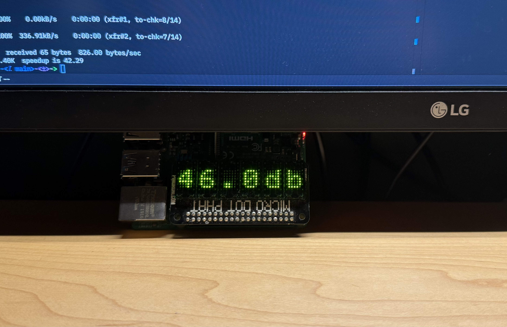

# yamadesk

A display that sits on my desk and displays the current volume of my [Yamaha R-N800A Stereo Network Receiver](https://usa.yamaha.com/products/audio_visual/hifi_components/r-n800a/index.html).

_Yamaha displays the volume in negative DB so that is what is shown here. It is not actually measuring the DB of the speakers._
